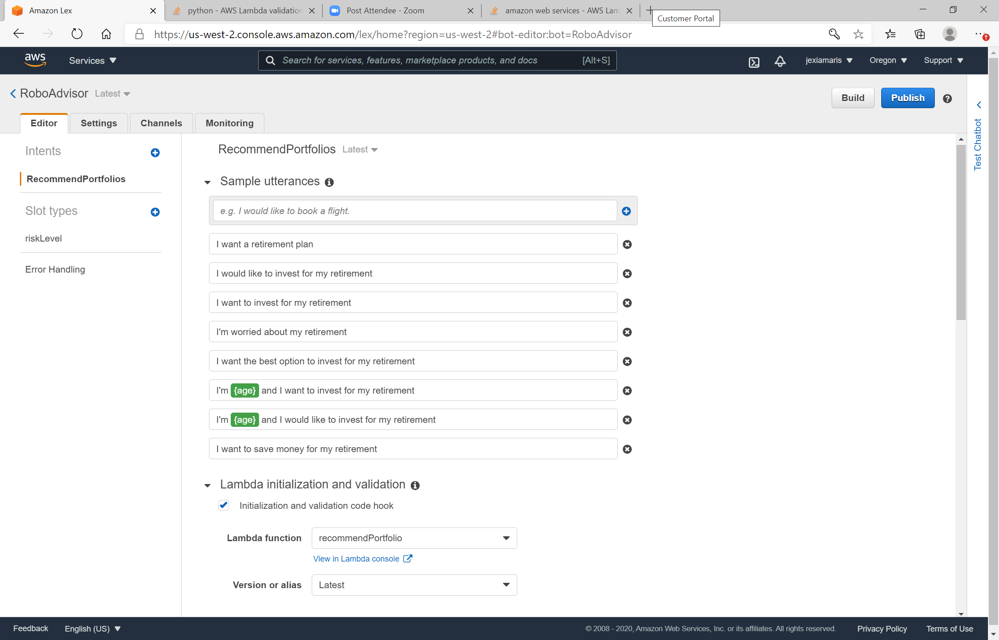
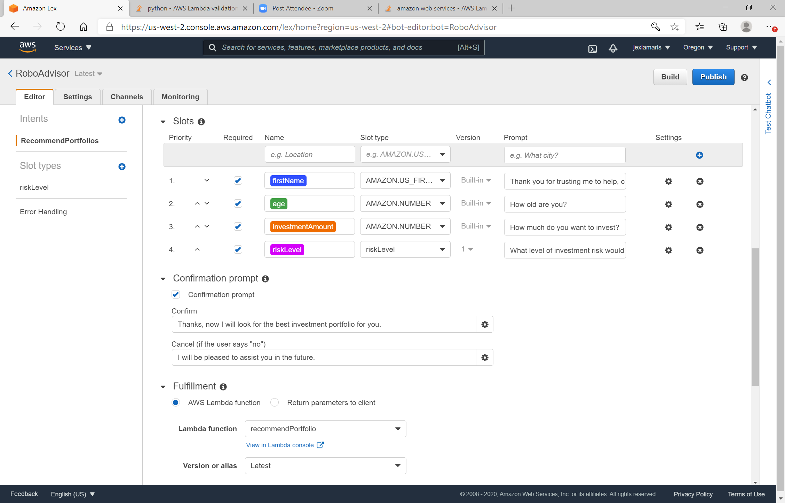

# Robo Advisor for Retirement Plans
This project was made on  Amazon Web Services using Amazon Lex and Lambda services to create a Robo advisor that could be used by customers or potential new customers to get investment portfolio recommendations for retirement. However, for a portfolio recommendations there are two limitations age which should be at least 1 and least that 65 years old, and investment amount which should be minimum $5,000. 
For Robo Advisor gives an investment recommendation the client must specify the level of risk is willing to take. These risk levels are none risk, very low, low, medium, high, and very high.

## Amazon Lex Console
The following images have the  bot, intent, and slot using Amazon Lex.

### Robo Advisor in Action
The following video is a demo of Robo Advisor in action from the test window.

